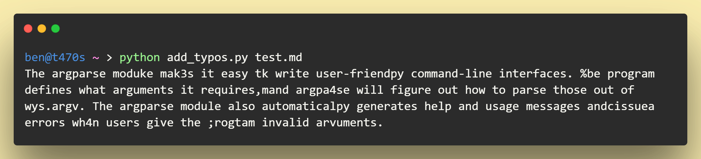
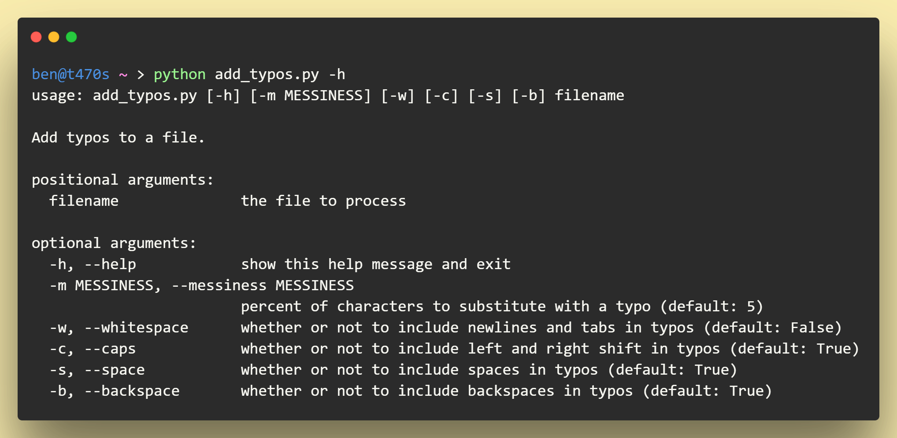

# typo adder
add (somewhat) realistic typos to a piece of writing. 

uses en-US QWERTY keyboard layout as a basedline for realism of typographic errors.

## example
using [test.md](test.md):

## usage
